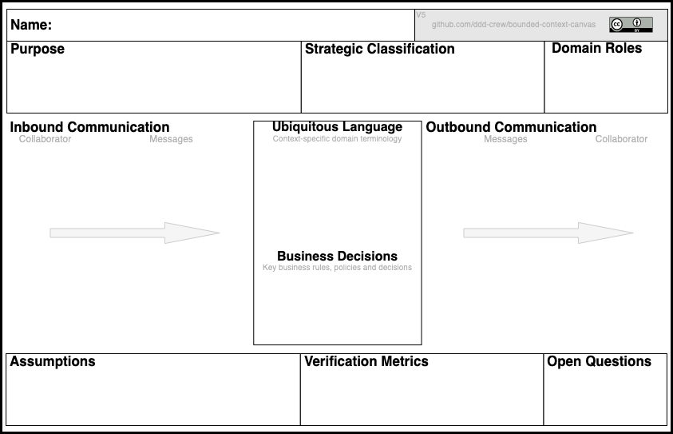

# Bounded Context Canvas how to

The *bounded context canvas* is described in [this blog post](https://medium.com/nick-tune-tech-strategy-blog/bounded-context-canvas-v2-simplifications-and-additions-229ed35f825f) by Nick Tune (highly recommended blog btw).

## Basic draw.io Usage

- Checkout this repository
- Head over to [draw.io](https://www.diagrams.net/) 
- Click "Open Existing Diagram"
- Select the `bounded-context-canvas-template.drawio.svg` template
- Make sure to have the "Content" layer activated and unlocked to fill your Canvas

## Advanced Usage / Optional Prerequisites

Besides the website, there are several options available to use draw.io:

- [Download Draw.io](https://github.com/jgraph/drawio-desktop/releases)
- [draw.io Diagrams for Confluence](https://marketplace.atlassian.com/apps/1210933/draw-io-diagrams-for-confluence)
- [Use draw.io diagrams in Google Docs](https://drawio-app.com/use-draw-io-diagrams-in-google-docs/)
- Visual Studio Code
  - [VS Code](https://code.visualstudio.com/)
  - [Draw.io Integration extension](https://marketplace.visualstudio.com/items?itemName=hediet.vscode-drawio)

Either way allows you to save the current template ([draw.io](https://www.diagrams.net/) and data filled in) as an SVG file (which can live next to the bounded context's code).

Doing so allows one to re-open the saved SVG file and update the filled in data.

## Bounded Context Canvas How to

- Either continue from a canvas you already started or start from the `bounded-context-canvas-template.drawio.svg`.
- Fill it in with your team.
- Save the current file near the bounded context's code.